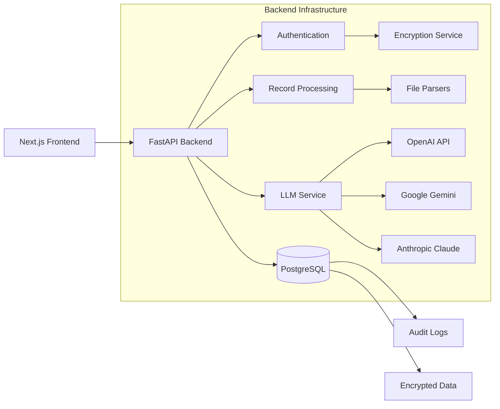

# AI Health Records Application

## Overview

An AI-driven health web application that ingests diverse medical records and leverages cloud LLMs (OpenAI, Google Gemini, Anthropic Claude) to provide intelligent health summaries, medical record management, and data-driven insights. Built with a focus on security, HIPAA compliance, and user privacy.

## ✨ Key Features

### Phase 1: Core Platform (✅ Completed)

- **🔐 Secure Authentication**
  - User registration and login with encrypted profiles
  - Session-based authentication with secure tokens
  - Password hashing with bcrypt

- **📊 Overview Dashboard**
  - Real-time health metrics and statistics
  - Recent uploads tracking
  - Activity monitoring with trends

- **📁 Medical Records Management**
  - Multi-format file upload (PDF, FHIR, EHR, plain text)
  - Secure document storage with AES-256-GCM encryption
  - Organization and viewing of medical records
  - Background processing for large file batches

- **🤖 AI-Powered Summaries**
  - LLM-driven health summaries using OpenAI, Google Gemini, or Anthropic Claude
  - Dynamic model selection based on capabilities
  - Summary history and management
  - Support for both text and image-based PDFs

### Phase 2: Evidence & Insights (Planned)

- **🔍 Evidence Search**
  - PubMed integration for medical literature
  - Evidence-based recommendations
  - Clinical guidelines integration

- **📈 Advanced Analytics**
  - Health trends visualization
  - Predictive insights
  - Risk assessment tools

### Phase 3: Clinical Integration (Future)

- **🏥 Healthcare System Integration**
  - HL7 FHIR connectivity
  - DICOM medical imaging support
  - EHR bidirectional sync

## 🛠️ Tech Stack

### Backend
- **Framework**: Python 3.11 with FastAPI
- **Database**: PostgreSQL with Prisma ORM
- **Security**: AES-256-GCM encryption, bcrypt, session tokens
- **LLM Integration**: OpenAI, Google Gemini, Anthropic Claude APIs
- **Document Processing**: PyPDF2, pdf2image, FHIR resources
- **Environment**: python-dotenv, uvicorn

### Frontend
- **Framework**: Next.js 15.2.4 with React 19
- **Language**: TypeScript 5
- **Styling**: Tailwind CSS with shadcn/ui components
- **State Management**: React Context (auth), planned Zustand
- **Forms**: React Hook Form with Zod validation
- **API Client**: Type-safe client with error handling

## 🏗️ Architecture



## 🚀 Getting Started

### Prerequisites
- Python 3.11+
- Node.js 18+
- PostgreSQL 14+
- Poppler (for PDF processing)

### Installation

1. **Clone the repository**
   ```bash
   git clone <repository-url>
   cd ai_web_records_app
   ```

2. **Backend Setup**
   ```bash
   cd backend
   pip install -r requirements.txt
   
   # Set up environment variables
   cp .env.example .env
   # Edit .env with your API keys and database credentials
   
   # Initialize database
   npx prisma generate
   npx prisma db push
   
   # Generate encryption keys
   python scripts/setup_keys.py
   ```

3. **Frontend Setup**
   ```bash
   cd frontend
   npm install
   # or
   pnpm install
   ```

4. **Run the Application**
   
   Backend:
   ```bash
   cd backend
   uvicorn main:app --reload
   ```
   
   Frontend:
   ```bash
   cd frontend
   npm run dev
   ```

5. **Access the Application**
   - Frontend: http://localhost:3000
   - Backend API: http://localhost:8000
   - API Documentation: http://localhost:8000/docs

## 🔒 Security & Compliance

### Implemented Security Features
- **Encryption**: AES-256-GCM for all sensitive data
- **Authentication**: Session-based with secure tokens
- **Password Security**: bcrypt with salt
- **Audit Logging**: Complete PHI access tracking
- **Data Isolation**: Row-level security for multi-tenancy
- **Input Validation**: Type checking and sanitization

### HIPAA Compliance
- Encryption at rest for all PII
- Access controls with role-based permissions
- Complete audit trail for data access
- Soft deletes for data retention
- Secure file handling and storage

## 📁 Project Structure

```
ai_web_records_app/
├── backend/
│   ├── main.py                    # FastAPI entry point
│   ├── prisma/
│   │   └── schema.prisma         # Database schema
│   ├── src/
│   │   ├── database/             # Database client
│   │   ├── models/               # Data models
│   │   ├── routes/               # API endpoints
│   │   │   ├── auth_routes.py    # Authentication
│   │   │   ├── dashboard_routes.py # Dashboard data
│   │   │   └── ingestion_routes.py # File upload
│   │   └── services/             # Business logic
│   │       ├── auth/             # Auth services
│   │       ├── security/         # Encryption, sessions
│   │       ├── ingestion/        # File processing
│   │       └── llm_service.py    # LLM integration
│   └── tests/                    # Test suites
├── frontend/
│   ├── app/                      # Next.js pages
│   │   ├── auth/                 # Login/register
│   │   ├── dashboard/            # Main app
│   │   └── layout.tsx            # Root layout
│   ├── components/               # React components
│   │   ├── auth/                 # Auth components
│   │   └── *.tsx                 # UI components
│   ├── contexts/                 # React contexts
│   └── lib/                      # Utilities
│       └── api-client.ts         # Backend API client
└── docs/                         # Documentation
```

## 🎯 Development Roadmap

### ✅ Phase 1: Core Health Records Platform (Complete)
- User authentication and secure sessions
- Medical record upload and management
- AI-powered health summaries
- Real-time dashboard with metrics
- HIPAA-compliant data handling

### 📋 Phase 2: Evidence & Insights (Next)
- PubMed medical literature search
- Evidence-based recommendations
- Advanced health analytics
- Predictive insights and trends
- Specialist finder integration

### 🚧 Phase 3: Clinical Integration (Future)
- FHIR/HL7 healthcare system integration
- DICOM medical imaging support
- Real-time EHR synchronization
- Clinical decision support
- Treatment plan recommendations

## 🧪 Testing

```bash
# Backend tests
cd backend
pytest

# Frontend tests (planned)
cd frontend
npm test
```

## 📝 API Documentation

The API documentation is available at http://localhost:8000/docs when running the backend.

Key endpoints:
- `POST /auth/register` - User registration
- `POST /auth/login` - User login
- `GET /dashboard/stats` - Dashboard metrics
- `POST /ingest/files` - File upload
- `POST /summarize-pdf/` - PDF summarization

## 🤝 Contributing

1. Create a feature branch from `master`
2. Follow the coding conventions in CLAUDE.md
3. Write tests for new features
4. Use conventional commits (`feat:`, `fix:`, `docs:`)
5. Update documentation as needed

## 📄 License

This project is proprietary software. All rights reserved.

## 🔗 Resources

- [FastAPI Documentation](https://fastapi.tiangolo.com/)
- [Next.js Documentation](https://nextjs.org/docs)
- [Prisma Documentation](https://www.prisma.io/docs)
- [HIPAA Compliance Guide](https://www.hhs.gov/hipaa/index.html)

---

Built with ❤️ for better healthcare outcomes through AI-driven insights.